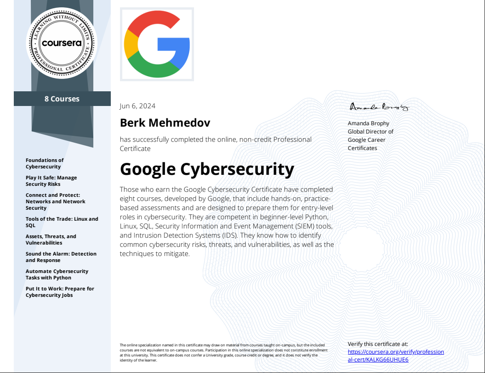

Earning this certificate allowed me to understand the fundamentals of blue teaming.

Covered topics include:

- Computer security incident management  
- Intrusion detection and prevention  
- Common cyber attacks and defense techniques  
- Threat management and vulnerability assessments  
- Network security fundamentals  
- SQL for security data analysis  
- Bash scripting for automation  
- Hands-on experience with SIEM tools like Elastic 

