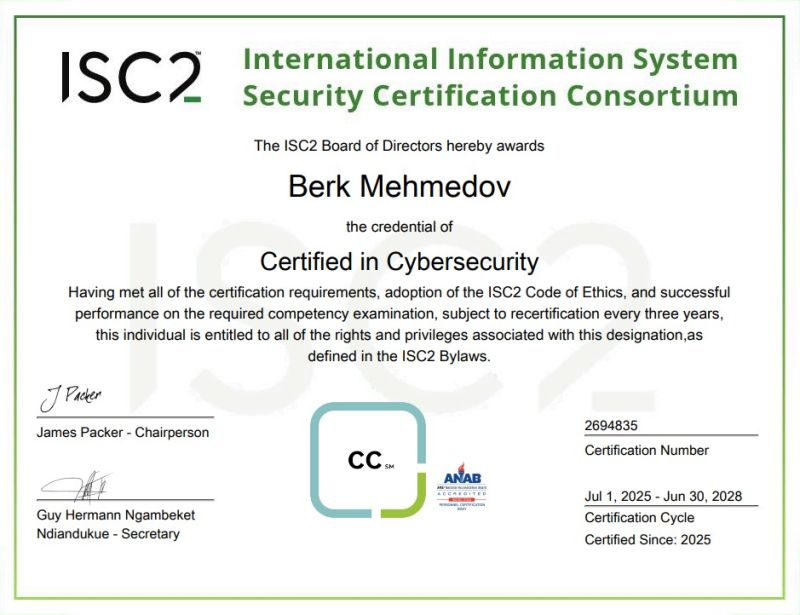

Earning this certification allows me to demonstrate foundational knowledge across five key domains:

- Security Principles  
- Business Continuity (BC)  
- Disaster Recovery (DR)  
- Incident Response  
- Access Control Concepts  
- Network Security  
- Security Operations

This certification affirms baseline competency in identifying and mitigating common threats, applying core security concepts, and supporting enterprise security operations.

